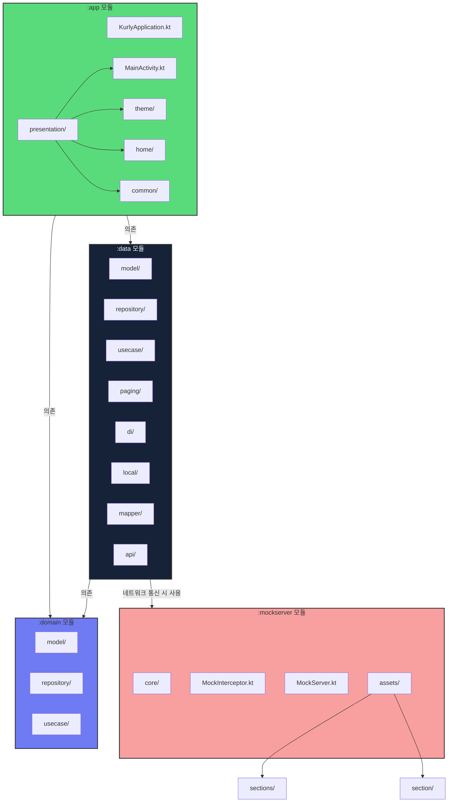

# Kurly-Commerce
컬리 상품리스트 클론 프로젝트

1. 실행 영상 

https://github.com/user-attachments/assets/63a6bbe0-e03e-4c8a-bbe0-60a833a63e19

-----------------------------------------------------------------------------------------------------------------------------------------------
2. 아키텍처 구조

-----------------------------------------------------------------------------------------------------------------------------------------------
3. 기술스택

| 분야 | 기술/라이브러리 | 설명 |
|------|---------------|------|
| UI | Jetpack Compose | 현대적인 선언형 UI 툴킷 |
| | Material3 | 머티리얼 디자인 컴포넌트 |
| | Splash Screen | 스플래시 화면 구현 |
| 비동기 처리 | Kotlin Coroutines | 비동기 프로그래밍 |
| | Flow | 비동기 데이터 스트림 |
| 의존성 주입 | Hilt | Dagger 기반 안드로이드 의존성 주입 라이브러리 |
| 네트워크 | Retrofit | REST API 클라이언트 |
| | OkHttp | HTTP 클라이언트 |
| | Gson | JSON 변환 라이브러리 |
| 이미지 로딩 | Coil | Kotlin 코루틴 기반 이미지 로딩 라이브러리 |
| 데이터 저장 | DataStore | SharedPreferences의 현대적 대안 |
| 페이징 | Paging 3 | 대용량 데이터 페이징 처리 |
| 로깅 | Timber | 개선된 로깅 유틸리티 |
| 아키텍처 | Clean Architecture | 계층화된 아키텍처 패턴 |
| | MVVM | 프레젠테이션 레이어 패턴 |
| | MockServer | 테스트용 모의 서버 |
| 빌드 도구 | Gradle (Kotlin DSL) | 빌드 자동화 시스템 |

-----------------------------------------------------------------------------------------------------------------------------------------------

